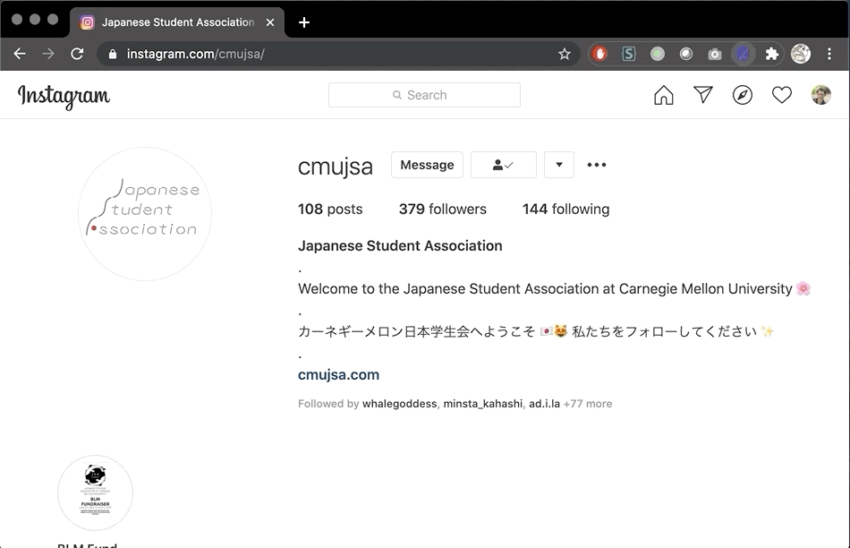

# shortener-chrome
A chrome extension to complement the JSA URL shortener service

## Usage

1. Navigate to a website other than [jsa.life](http://jsa.life)
1. Open the extension and input a custom short (optional)
1. Click SHORTEN
1. _Voila!_ Click on the generated link to copy to clipboard

## Setup

1. Git clone this repo
1. Open Google Chrome
1. Click on the extensions icon on the top-right corner, and select `Manage extensions`
1. Enable `Developer mode` by toggling the switch on the the top-right corner
1. Click on the `Load unpacked` button on the top-left corner
1. Select the cloned repo
1. _Voila!_ Enjoy your extension experience
